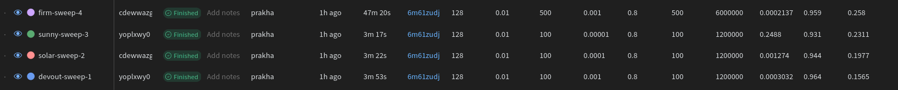
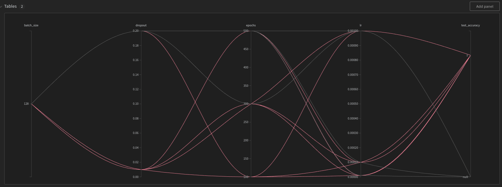

# [Simple Sweep](https://docs.wandb.ai/guides/sweeps)
1. **Define the sweep**: Similar to Hydra we can use a `yaml` file.
    * Not sure if W&B supports arg parsing of sweep settings. 
    * Also, similar to Hydra-zen it allows defining setting as a dictionary.
    * [Example](https://github.com/wandb/examples/tree/master/examples/keras/keras-cnn-fashion) of yaml files.
2. Initialise the sweep using `wandb.sweep` method.
3. Run the sweep agent using `wandb.agent` method. This is exactly the same as Hydra-zen, where the entire content is defined in the main() method.

## Search methods
* `grid` :  Iterate over every combination of hyperparameter values.
* `random` :  Select each new combination at random according to provided distribution.
* `bayes`:  Create a probabilistic model of metric score as a function of the hyperparameters, and choose parameters with high probability of improving the metric. Works well for small numbers of continuous parameters but scales poorly.

```python
sweep_config = {
    'method': 'random'
    }
```
## Define goal
This is only applicable for `bayes` sweeps.
```python
metric = {
    'name': 'loss',
    'goal': 'minimize'   
    }

sweep_config['metric'] = metric
```
## Define settings
```python
parameters_dict = {
    'optimizer': {
        'values': ['adam', 'sgd']
        },
    'fc_layer_size': {
        'values': [128, 256, 512]
        },
    'dropout': {
          'values': [0.3, 0.4, 0.5]
        },
    }

sweep_config['parameters'] = parameters_dict
```
### Updating list of hyperparameters
```python
parameters_dict.update({
    'epochs': {
        'value': 1}
    })
```
## How are the values chosen
* For a `grid` search, that's all you ever need.
* For a `random` search, all the values of a parameter are equally likely to be chosen on a given run.
* For a `bayes`ian search, you need to specify a `distribution` with its parameters such as `mu`, standard deviation `sigma` of a `normal` distribution. [Here](https://docs.wandb.ai/guides/sweeps/define-sweep-configuration#distributions) is a detailed guide.

## Early termination
We can use [Hyperband](https://arxiv.org/pdf/1603.06560.pdf) scheduling algorithm for early termination.

The main sweep controller is on the W&B server and agents run on our local machine. Will have to look what we can leverage with this design.

## Delay in results
The server might take 10-15 mins to display the results on the web portal. This makes more sense when models might take hours for 1 run.



We can plot various things such as parallel coordinate plot from the "Add Panel" button workspaces.



