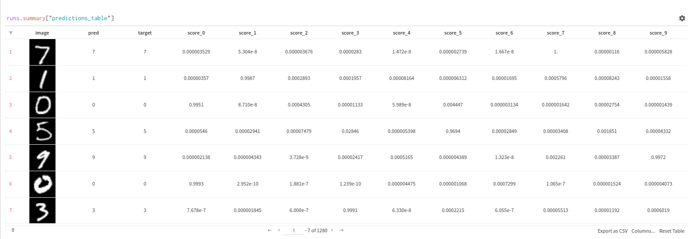
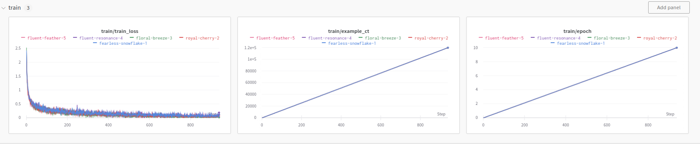
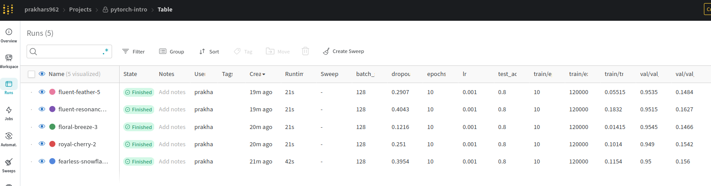

In this folder, we have tutorial, that logs 5 different runs with different dropout rate using a for loop in the python file. Now this may not be very useful for long training and it is better to use a config file to deal with sweeps.

The tutorial also demonstrates that we can create tables using `wand.Table`. We can also add images in table using `wandb.Image`. The table looks like this

The table contains concatenates all the runs. We can click on individual tables to see individual results. The Table can also be exported as csv (can be found the same folder).

We can also plots graphs such as loss, accuracy just by logging them for all runs combined or individually.

In addition to these, we can also see GPu usage for each run, which I don't really care. Similar to mlflow we can see a summary of all runs. it also logs time by default.

