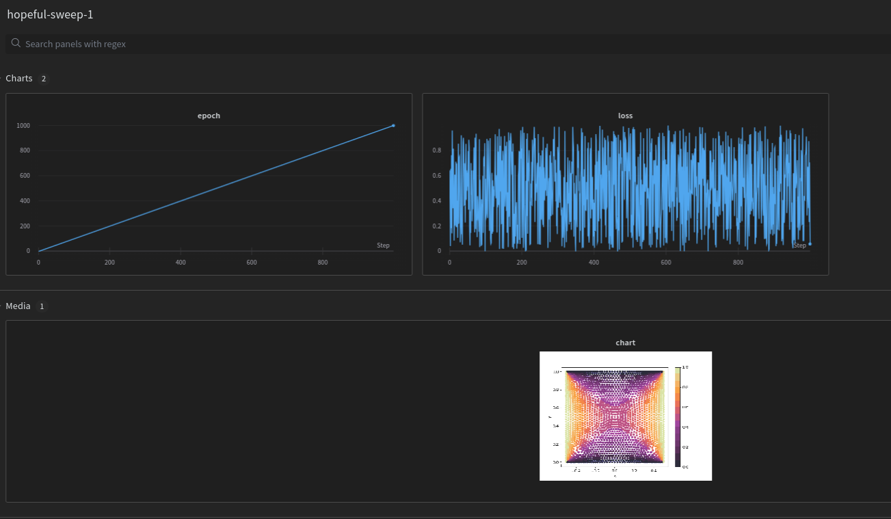

# Log artifacts
As per [this](https://community.wandb.ai/t/matplotlib-into-wandb/3212) forum issue, we can use the following command to log an image generated in matplotlib.

```python
wandb.log({ 'chart' : wandb.Image(fig) })
```

The logged image may look dull on the web portal, but once you download them the look as it is. All the plots can be found under media section for each run.



We can zoom in to the figure.