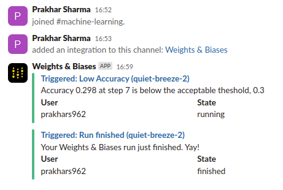
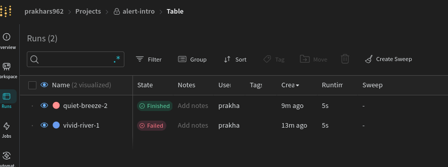

We can also send email alerts or message to Slack channel about the progress. Just head on to the user settings and turn of email or slack. I'd use slack because i don't want to email to be filled with runs message.

The message is sent automatically when runs finishes. We can send an alert as follows:

```python
wandb.alert(
    title="Low accuracy", 
    text=f"Accuracy is below the acceptable threshold"
)
```
This is the message sent to the Slack channel.



The first message is alert and second one is for run finished.

In addition to this, if the job fails due to timelimit of any error we will see the `Failed` in Status.

