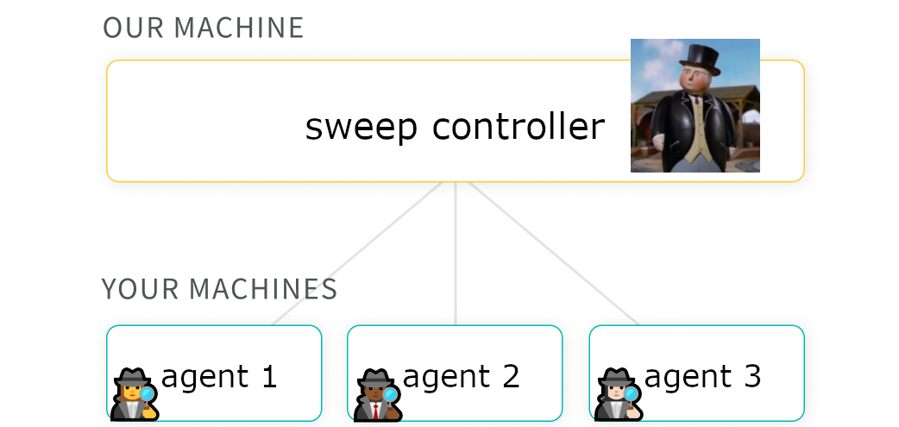
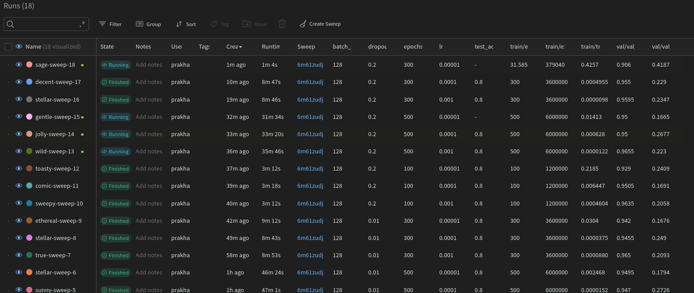
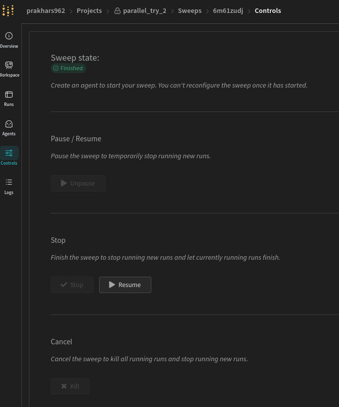

# Parallel sweeps
So, WandB allows the user to parallise the sweeps on multiple GPU. Fortunately, this is OOTB unlike Hydra where you need to do a lot of coding. Here is a use case:

* Say, I have to sweep across 4000 parameters settings/runs.
* The `TIMELIMIT` of SLURM's node is 2 days. You can check the `TIMELIMIT` of each node using `sinfo`.

Naturally, we need to break down the jobs into fewer parameter setting. Hydra doesn't have an OOTB solution for this. Suppose you want to breakdown the job into 80 small jobs. The easiest solution is to create 80 separate job scripts and manually or using another script change the parameter settings in each job script.

The intriguing thing about WandB is that you don't need break down the parameter settings. Instead, there is a main sweep controller on the Wandb server and the local machines are called the agents.



Here for a specific project, the sweeps are initialised on the WandB server and the server manages the configs or parameter setting being sent to the agents depending on the sweep type chosen i.e. `grid` or `random` etc.

We just need to go the web portal and create a new project. In the left pane look for sweeps, then create a new sweep. It will ask for the configs. Just pass the python file name and the parameter settings as follows:

```sh
program: run.py  # Updated to your script's name
method: grid
parameters:
  epochs:
    values: [100, 500, 300]
  batch_size:
    values: [128]
  dropout:
    values: [0.01, 0.20, 0.50, 0.80]
  lr:
    values: [1e-3, 1e-4]
```
The web portal will give you a command to run of local machines to start obtaining sweep parameters. The command looks like following:

```sh
wandb agent [YOUR_USERNAME]/[YOUR_PROJECT_NAME]/[NEW_SWEEP_ID]
```

All you need to do is remove anything related to loading the configs in the python file. Here is a minimal.

```python
import wandb
import random

def train():
    # Initialization will automatically use the config provided by the sweep
    with wandb.init():
        config = wandb.config
        
        print("Optimiser: ", config.optimizer)
        print("Number of layers: ", config.fc_layer_size)
        print("Dropout: ", config.dropout)
        
        for epoch in range(1000):  # loop over the dataset multiple times
            loss = random.random()
            wandb.log({'epoch': epoch + 1, 'loss': loss})

        print('Finished Training')

if __name__ == "__main__":
    train()
```

The command `wandb agent` will arg parse the configs to `__main__` and will be available as global variable. So, don't use variable `config` in the python file for anything else.

Now we can submit the same job script multple times and SLURM will assign separate GPU for each job. If you execute 4 jobs you will see 4 workers in WandB web portal.



All you need to do is repeatedly run the same script multiple times to add more agents/ workers.

Once all the sweeps are finished, you will see this in the error.log of sbatch.

```sh
wandb: Starting wandb agent 🕵️
wandb: ERROR Error while calling W&B API: Sweep prakhars962/parallel_try_2/6m61zudj is not running (<Response [400]>)
wandb: ERROR Find detailed error logs at: /scratch/s.1915438/k/wandb/debug-cli.s.1915438.log
Error: Sweep prakhars962/parallel_try_2/6m61zudj is not running
```

On the web portal you will see `Finished` in the controls tab.



